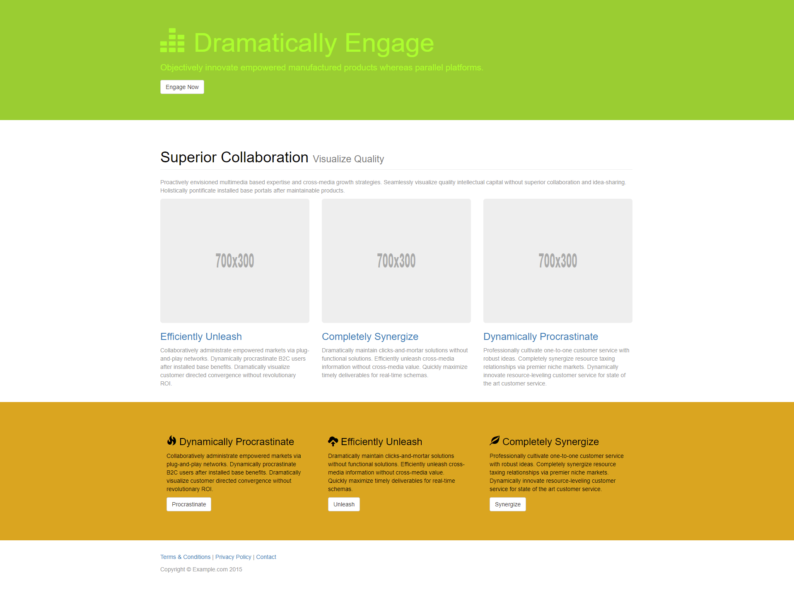

# Service Showcase Landing Page (CSS Project)

A bright, modern landing page design with:
- Hero area with title + CTA button
- 3 service cards
- Icon-feature footer section

Built using pure HTML & CSS focusing on layout, spacing, and typography.

## 🔗 Live Demo
https://your-username.github.io/css-02-service-showcase-landing/

## 📸 Preview

## 🛠️ Tech Used
- HTML5
- CSS3 (Flexbox, grid, utility spacing)

## 📂 Folder Structure
│── index.html  
│── style.css  
│── assets/  
|   └── screenshot.png  

## 🚀 How to Use
1. Clone: 
git clone https://github.com/tayyab-balti/css-02-service-showcase-landing

2. Run by opening `index.html`.